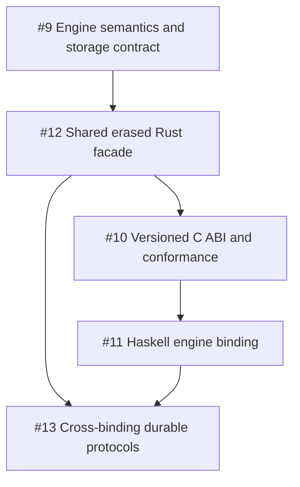

# Roadmap

## One engine, native Rust, idiomatic Haskell

Release 0.4.0 makes one Rust engine the authoritative implementation for every
storage transition while preserving typed, idiomatic Rust and Haskell surfaces.
The first deliverable is the shared semantic contract because every facade,
binding, and integration test depends on it.

- [ ] [#9 Engine behavior is duplicated across language implementations](https://github.com/dataclique/event-sorcery/issues/9)
- [ ] [#12 The native Rust API does not share an erased engine facade with foreign bindings](https://github.com/dataclique/event-sorcery/issues/12)
- [ ] [#10 Cross-language engine calls lack a stable ABI and conformance contract](https://github.com/dataclique/event-sorcery/issues/10)
- [ ] [#11 The monorepo has no Haskell binding over the native engine](https://github.com/dataclique/event-sorcery/issues/11)
- [ ] [#13 Durable protocols lack end-to-end cross-binding conformance coverage](https://github.com/dataclique/event-sorcery/issues/13)

## Not epic

- [ ] [#6 sqlite_event_repository is SQLite-specific code inside the backend-agnostic core](https://github.com/dataclique/event-sorcery/issues/6)
